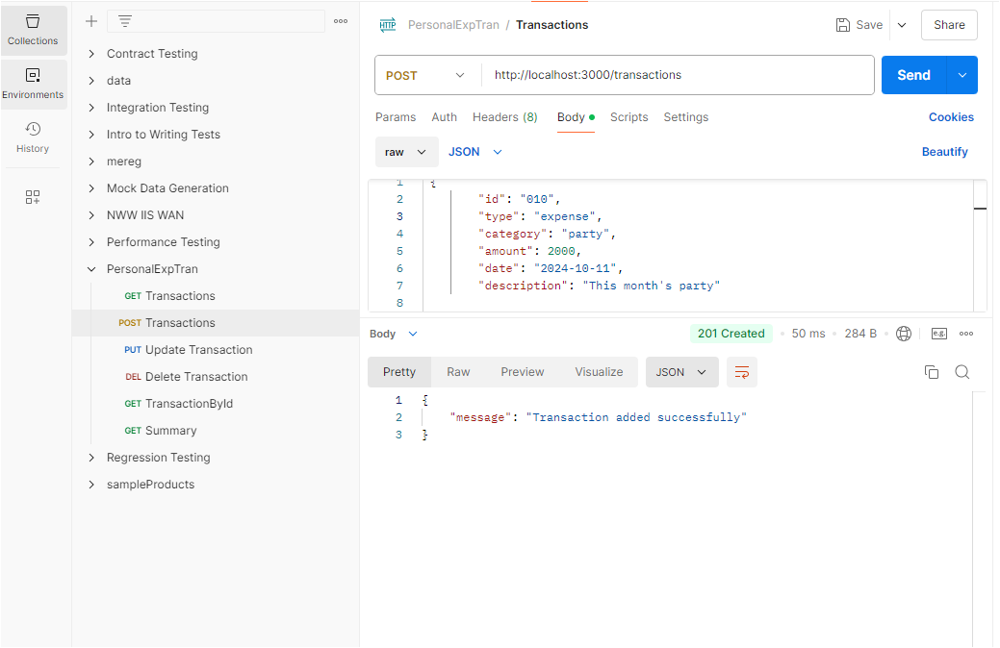
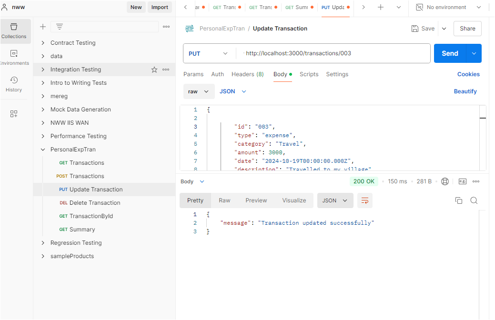
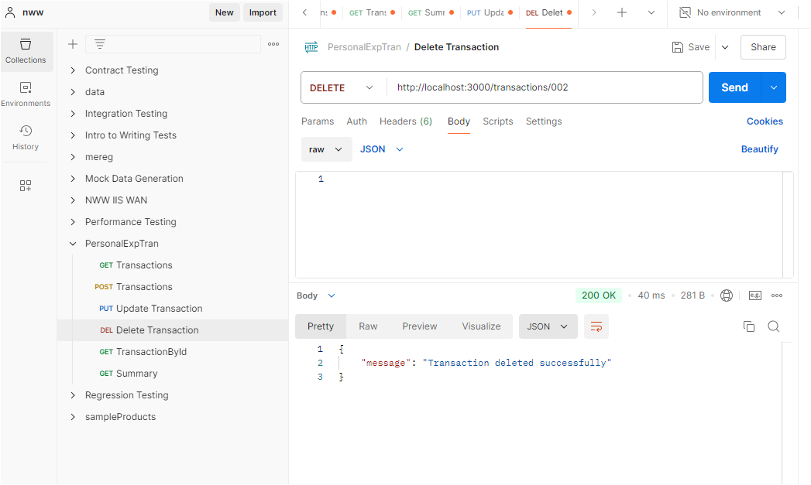
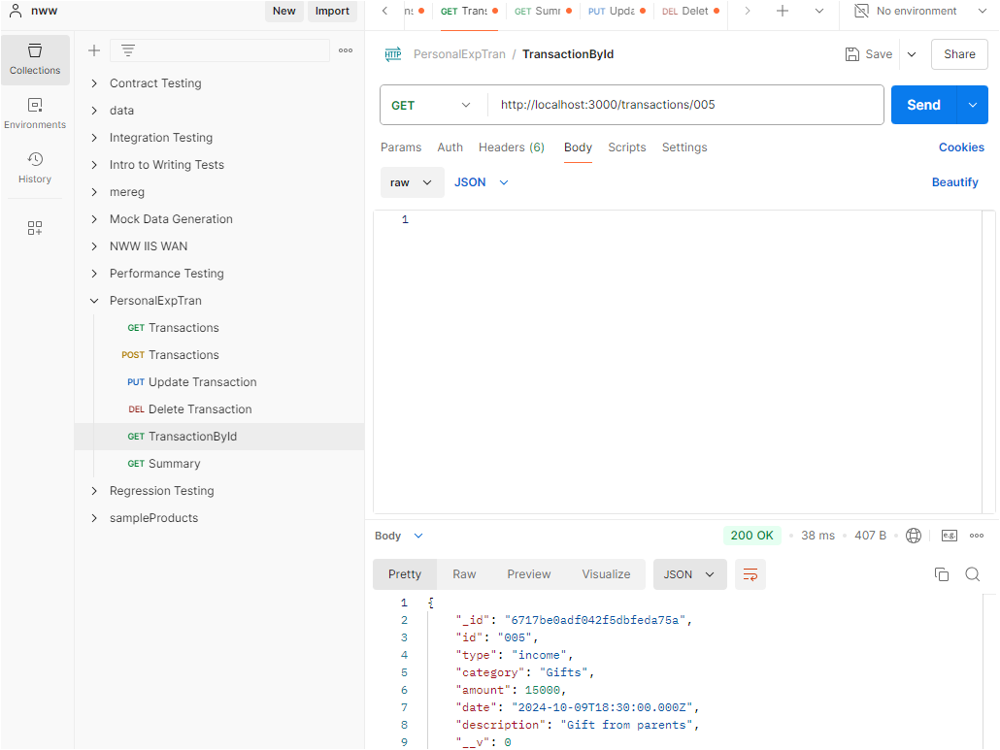
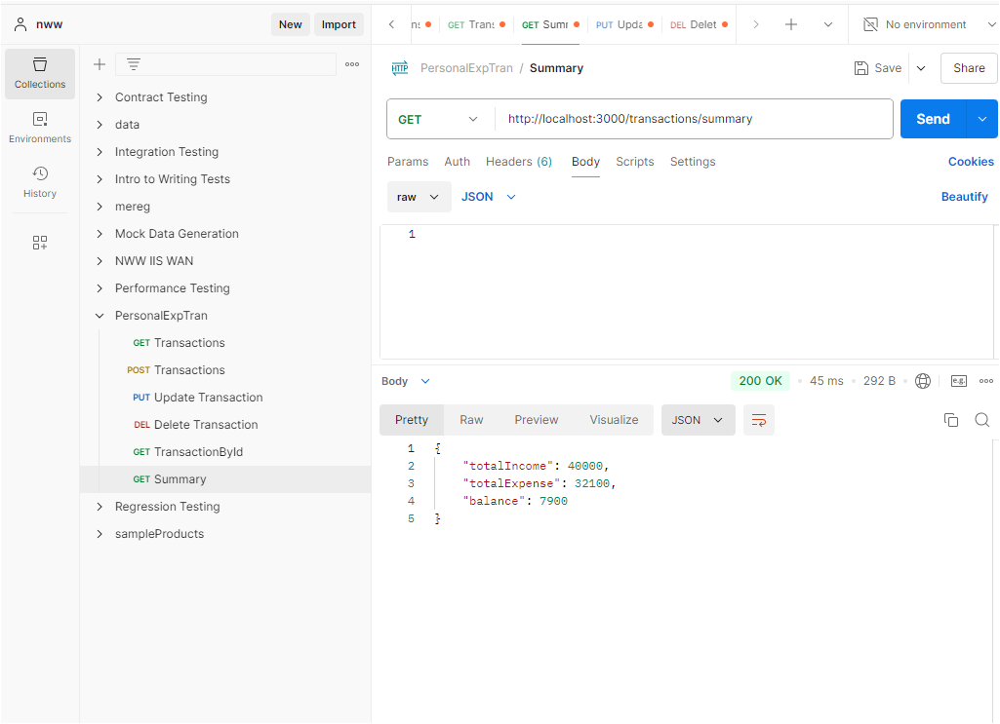
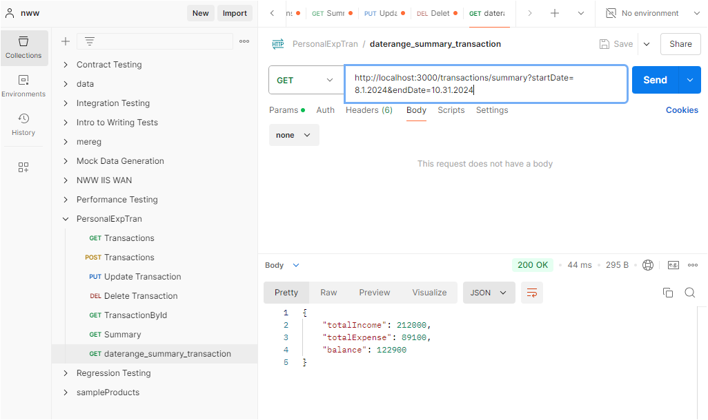

Initial Setup:

1.  Install Dependencies:
    npm init -y
    npm install express mongoose
    After installation please check your package.json file for all the installed dependencies and their versions.
2.  Set up the server.js with the Mongodb connection string as the selected database is Mongodb.
3.  Mongodb

    1. Created clusterpet by providing access permissions to all the Ipv4
    2. For better performance dropped the index which is creating automatically
    3. Used Mongodb compass.

4.  Selected Database is Mongodb.
    Defining the collections transactions and categories
    Transactions Collection:
    {
    "type": "income" or "expense",
    "category": "string",
    "amount": "number",
    "date": "ISODate",
    "description": "string"
    }
    Categories collection:

            {

                "name": "string",
                "type": "income" or "expense"

            }

5.  API Endpoints

            1. POST /transactions - Add a new transaction

            Request Body:
            {
            "type": "income",
            "category": "salary",
            "amount": 1000,
            "date": "2023-10-22",
            "description": "October salary"
            }
            Response:

                {

                     "message": "Transaction added successfully"
                }

            2. GET /transactions - Retrieve all transactions

            Response:
            [
            {
            "_id": "transaction_id",
            "type": "income",
            "category": "salary",
            "amount": 1000,
            "date": "2023-10-22",
            "description": "October salary"
            }
            ]

            3. GET /transactions/:ID

            - Retrieve a transaction by ID
              Response:

                    {
                        "_id": "transaction_id",
                        "type": "income",
                        "category": "salary",
                        "amount": 1000,
                        "date": "2023-10-22",
                        "description": "October salary"
                    }

            4. PUT /transactions/:ID

            - Update a transaction by ID

              Request Body:
              {
              "amount": 1200
              }

              Response:

                    {
                        "message": "Transaction updated successfully"
                    }

            5. DELETE /transactions/:ID

            - Delete a transaction by ID

              Response:
              {
              "message": "Transaction deleted successfully"
              }

            6. GET /summary - Retrieve a summary of transactions
               Query Parameters: Optionally filter by category, date range.

               Response:
               {
               "totalIncome": 5000,
               "totalExpenses": 3000,
               "balance": 2000
               }

Below are the API calls images through Postman

1. To GET all transactions

   GET http://localhost:3000/transactions

   

2. To INSERT/CREATE a transactions

   POST http://localhost:3000/transactions

   

3. To UPDATE a transactions

   PUT http://localhost:3000/transactions/003

   

4. To DELETE a transaction

   DELETE http://localhost:3000/transactions/002

   

5. To GET a specified trasaction

   GET http://localhost:3000/transactions/005

   

6. To GET the overall summary of all the transactions

   GET http://localhost:3000/transactions/summary

   

7. To GET summary for a specific date range , which gives total income, total expenses and balance for that particular date range.

   GET http://localhost:3000/transactions/summary?startDate= 8.1.2024&endDate=10.31.2024

   

8. To GET summary for a specific category

   http://localhost:3000/transactions/summary?category=Party
