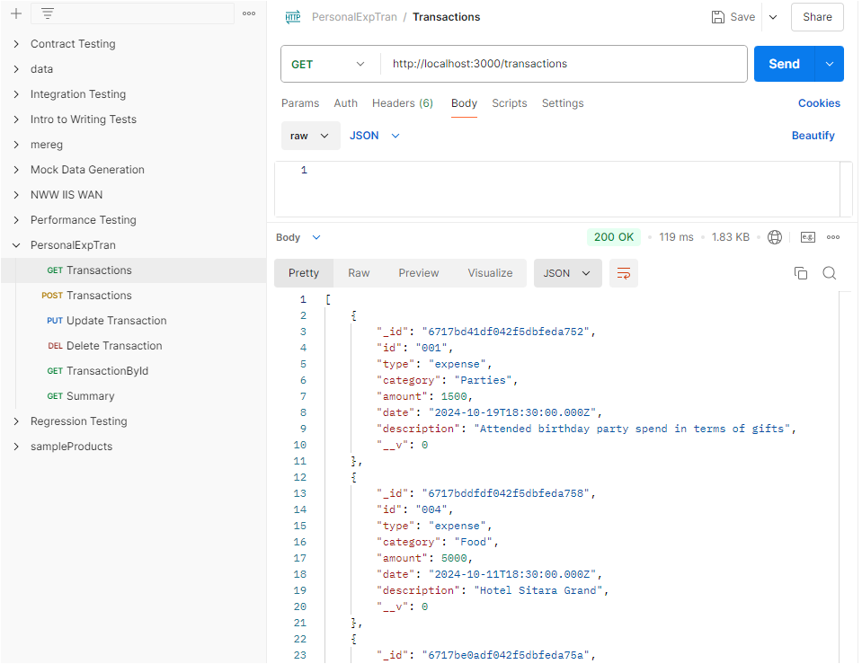

1.  Selected Database is Mongodb.
    Defining the collections transactions and categories
    Transactions Collection:
    {
    "type": "income" or "expense",
    "category": "string",
    "amount": "number",
    "date": "ISODate",
    "description": "string"
    }
    Categories collection:

            {

                "name": "string",
                "type": "income" or "expense"

            }

2.  API Endpoints

        1. POST /transactions - Add a new transaction

        Request Body:
        {
        "type": "income",
        "category": "salary",
        "amount": 1000,
        "date": "2023-10-22",
        "description": "October salary"
        }
        Response:

            {

                 "message": "Transaction added successfully"
            }

        2. GET /transactions - Retrieve all transactions

        Response:
        [
        {
        "_id": "transaction_id",
        "type": "income",
        "category": "salary",
        "amount": 1000,
        "date": "2023-10-22",
        "description": "October salary"
        }
        ]

        3. GET /transactions/:ID

        - Retrieve a transaction by ID
          Response:

                {
                    "_id": "transaction_id",
                    "type": "income",
                    "category": "salary",
                    "amount": 1000,
                    "date": "2023-10-22",
                    "description": "October salary"
                }

        4. PUT /transactions/:ID

        - Update a transaction by ID

          Request Body:
          {
          "amount": 1200
          }

          Response:

                {
                    "message": "Transaction updated successfully"
                }

        5. DELETE /transactions/:ID

        - Delete a transaction by ID

          Response:
          {
          "message": "Transaction deleted successfully"
          }

        6. GET /summary - Retrieve a summary of transactions
           Query Parameters: Optionally filter by category, date range.

           Response:
           {
           "totalIncome": 5000,
           "totalExpenses": 3000,
           "balance": 2000
           }

    Below are the API calls images through Postman
    GET http://localhost:3000/transactions

